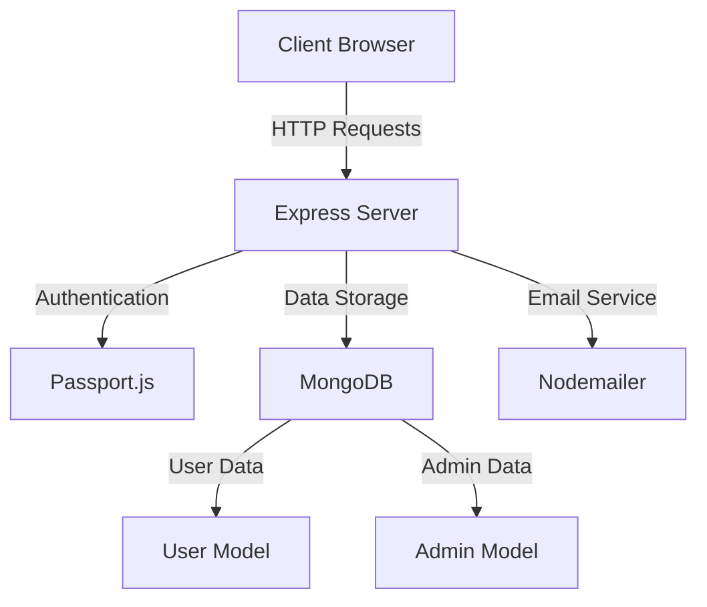

# 📊 TimeSheet Management System

A modern web-based timesheet management application built with Node.js, Express, and MongoDB.

## ✨ Features

- 👥 User Authentication & Authorization
  - Login/Register system
  - Password reset functionality with email verification
  - Admin and regular user roles

- ⏰ Time Entry Management
  - Add daily timesheet entries
  - Track time by project and category
  - Add remarks for each time entry
  - Delete entries as needed

- 📊 Data Visualization
  - List view of all time entries
  - Calendar-based view
  - Export functionality (CSV format)

- 👑 Admin Features
  - Manage users and admin privileges
  - Add/Edit/Delete projects
  - Manage activity categories
  - Export all users' timesheet data

## 🏗️ System Architecture



## 🛠️ Technology Stack

- **Backend**: Node.js, Express.js
- **Database**: MongoDB with Mongoose ODM
- **Authentication**: Passport.js, bcryptjs
- **Frontend**: EJS templates, Bootstrap 4
- **Email Service**: Nodemailer
- **Other Tools**: async, connect-flash

## 🚀 Getting Started

1. Clone the repository
2. Install dependencies:
   ```bash
   npm install
   ```
3. Configure environment variables:
   - MongoDB connection URL
   - Email service credentials

4. Start the application:
   ```bash
   npm start
   ```

## 📝 API Routes

### Authentication Routes
- `GET /users/login` - Login page
- `POST /users/login` - Process login
- `GET /users/register` - Registration page
- `POST /users/register` - Process registration
- `GET /users/forgot` - Forgot password page
- `POST /users/reset/:token` - Reset password

### Main Application Routes
- `GET /dashboard` - User dashboard
- `POST /timeSheetData` - Submit timesheet entries
- `GET /admin` - Admin console
- `GET /listview` - View timesheet entries
- `GET /export` - Export timesheet data

## 💼 Project Structure

```
├── app.js              # Application entry point
├── config/            
│   ├── auth.js         # Authentication middleware
│   └── passport.js     # Passport configuration
├── models/
│   ├── user.js         # User model schema
│   └── admin.js        # Admin model schema
├── routes/
│   ├── index.js        # Main routes
│   └── users.js        # Authentication routes
└── views/
    ├── dashboard.ejs   # Main dashboard
    ├── admin.ejs       # Admin console
    ├── listview.ejs    # Time entries view
    └── partials/       # Reusable components
```

## 🔒 Security Features

- Password hashing using bcryptjs
- Session-based authentication
- Protected routes using middleware
- Secure password reset system
- CSRF protection

## 👥 User Types

1. **Regular Users**
   - Submit timesheet entries
   - View personal entries
   - Manage own profile

2. **Administrators**
   - All regular user features
   - Manage users and their roles
   - Configure projects and categories
   - Export all users' data

## 📱 Screenshots

[Screenshots would be added here]

## 🤝 Contributing

Contributions, issues, and feature requests are welcome!

## 📝 License

ISC License - See LICENSE file for details

## 👤 Author

**Abhijith B N**

---
⭐️ Star this project if you find it useful!